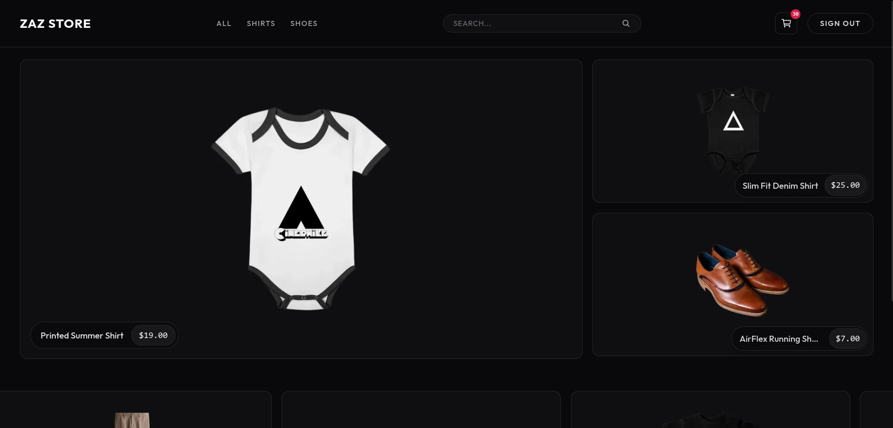
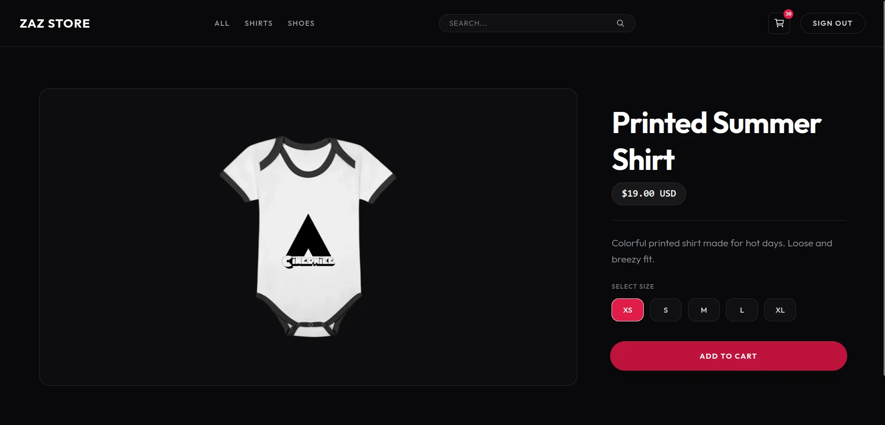
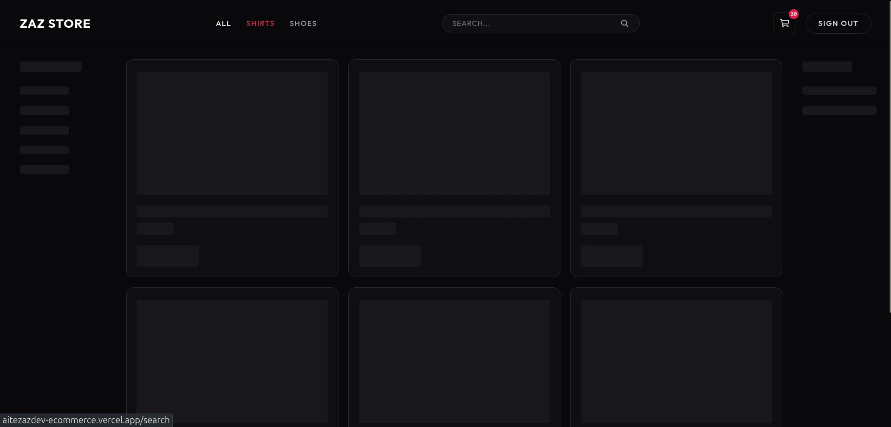
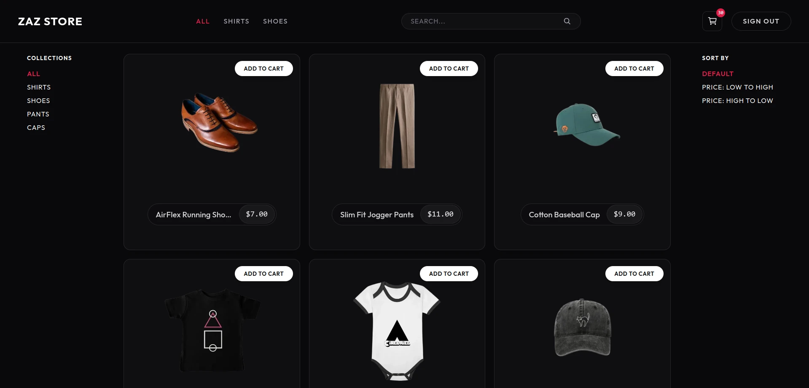
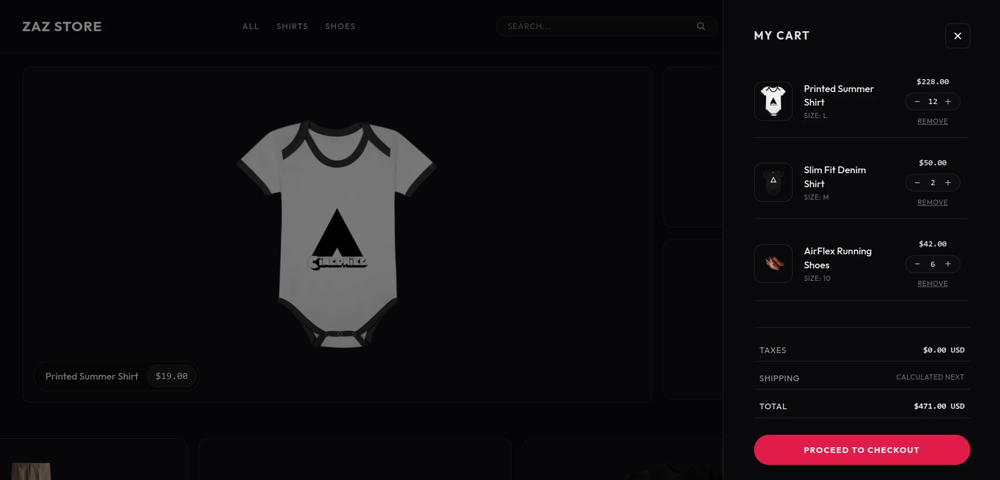
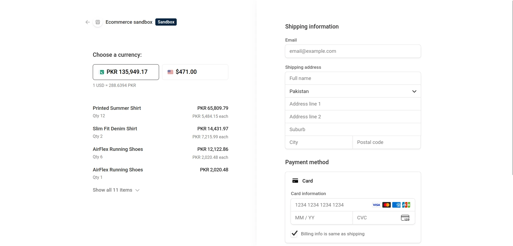

# Next.js Ecommerce

A full-stack e-commerce web application built using Next.js 16, React 19, and TypeScript. The application uses server-side rendering for catalog queries, implements optimistic state updates for the shopping cart using React 19 hooks, and handles checkouts via Stripe. It uses Mongoose to interact with MongoDB, featuring connection caching with an automatic fallback to local mock data if the database is offline.

## Key Features

- **Server-Side Rendering (SSR)**: Resolves product catalogs, specific categories, and search listings on the server to optimize loading speeds and search engine crawlability.
- **Optimistic State Cart Updates**: Employs React 19 `useOptimistic` and `useTransition` hooks to update cart item quantities immediately in the UI. If a background server request fails, the cart rolls back to the previous state and displays a notification.
- **Asynchronous State Management**: Implements Redux Toolkit to manage cart actions, authentication state, and async operations across the application.
- **Data Validation**: Uses Zod schemas to validate user credentials, registration forms, and product models on both the client (via React Hook Form resolvers) and the server API routes.
- **Resilient Database Connectivity**: Implements Mongoose connection caching to reuse database connections. Includes a 10-second cooling-down period after failures and fallback mock data to prevent complete page errors if MongoDB is offline.
- **Authentication**: Provides secure credential-based login and registration using bcryptjs for password hashing and JSON Web Tokens (JWT) for session management.
- **Stripe Checkout Integration**: Integrates Stripe payment gateway redirected checkouts for secure transaction processing.

## Technical Stack

### Frontend
- Next.js 16 (App Router)
- React 19
- Tailwind CSS 4
- Redux Toolkit
- React Hook Form
- Axios
- React Icons
- React Loading Skeleton

### Backend
- Next.js Route Handlers (API endpoints)
- JSON Web Tokens (JWT) for authentication
- BcryptJS for password hashing
- Zod for validation schemas

### Database & Payment Services
- MongoDB with Mongoose ODM
- Stripe API

## Local Development Setup

### Prerequisites
- Node.js (version 18 or above recommended)
- npm package manager
- A running MongoDB instance (local or MongoDB Atlas cluster)

### 1. Clone the Repository
```bash
git clone https://github.com/vilezaz/Next.js-Ecommerce.git
cd Next.js-Ecommerce
```

### 2. Install Dependencies
```bash
npm install
```

### 3. Configure Environment Variables
Create a `.env.local` file in the root directory and define the following variables:
```env
# Database Configuration
MONGO_URI=mongodb+srv://<username>:<password>@cluster.mongodb.net

# Authentication Configuration
JWT_SECRET=your_jwt_secret_string

# Stripe Payments Configuration
NEXT_PUBLIC_STRIPE_PUBLISHABLE_KEY=pk_test_your_publishable_key
STRIPE_SECRET_KEY=sk_test_your_secret_key
```

### 4. Start the Application
To launch the local development server:
```bash
npm run dev
```
Open [http://localhost:3000](http://localhost:3000) in your web browser to access the application.

To build the application for production:
```bash
npm run build
npm run start
```

## Visual Preview

Below are screenshots showing the layout and user flow of the application:

### Home Page


### Product Listing


### Loading Skeletons


### Product Details


### Category Selection


### Shopping Cart View

